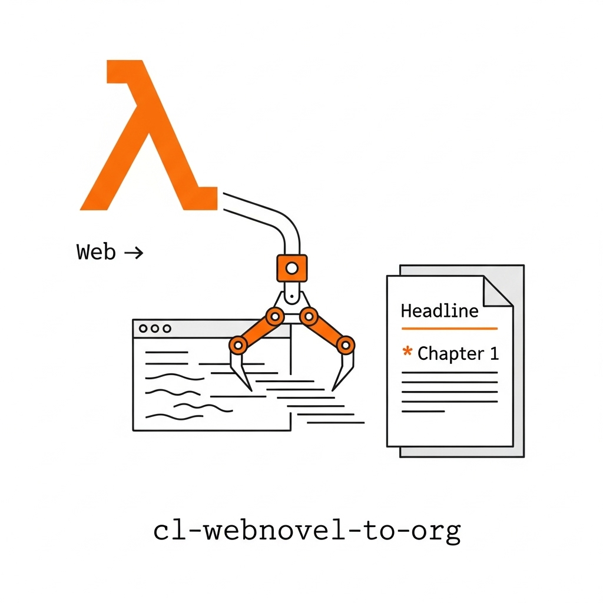

<p align="center">
  
</p>

<h1 align="center">cl-webnovel-to-org</h1>

<p align="center">
  <a href="https://www.lisp-lang.org/">
    
  </a>
  <a href="./LICENSE">
    
  </a>
</p>

A command-line tool written in Common Lisp to scrape webnovels from a website and compile them into a single, clean Org-mode file. Once you have the Org file, you can easily convert it to other formats like EPUB or PDF using Pandoc.

## Features

- **Interactive Setup**: Guides you through the process of providing the necessary information.
- **Scriptable**: Can be run non-interactively by providing arguments, making it suitable for scripts.
- **Content Scraping**: Extracts chapter titles and body content.
- **Image Support**: Preserves images from the novel.
- **Comment Filtering**: Can exclude comment sections from the output.
- **Custom Stop Points**: Allows you to specify text that, when encountered, will stop the scraping process (e.g., "End of Volume").
- **Org-mode Formatting**: Generates a well-structured Org file with a title, author, and creation date.

## Dependencies

- [Dexador](https://github.com/fukamachi/dexador): High-performance HTTP client for Common Lisp.
- [lquery](https://github.com/g000001/lquery): A DOM manipulation library for Common Lisp, similar to jQuery.
- [local-time](https://github.com/dlowe-net/local-time): A library for manipulating dates and times.
- [split-sequence](https://github.com/eshamster/split-sequence): A utility for splitting sequences.
- [quri](https://github.com/fukamachi/quri): A URI manipulation library.
- [jonathan](https://github.com/fukamachi/jonathan): A JSON encoder/decoder.
- [cl-ppcre](https://github.com/edicl/cl-ppcre): A portable Perl-compatible regular expression library.

These will be installed automatically via Quicklisp.

## Advanced Features

This tool includes several strategies to find the "next chapter" link, making it more robust and adaptable to different website structures. These strategies are tried in order until one succeeds:

1.  **User-Provided Selector**: Uses the CSS selector you provide.
2.  **Keyword Search**: Looks for links with common "next" keywords (e.g., "Next", "next", ">").
3.  **`rel="next"` Attribute**: Searches for a link with the `rel="next"` attribute, a common web standard.
4.  **Embedded JSON Data**: Parses embedded JSON data in the page, which is common on modern, JavaScript-heavy websites.

## Installation

There are two ways to install and use this tool.

### 1. From Source (Recommended)

1.  Clone this repository into your `~/quicklisp/local-projects/` directory.
2.  Ensure you have a modern Common Lisp implementation like [SBCL](http://www.sbcl.org/) installed.
3.  You can then run the tool directly from your Lisp REPL.

### 2. Build a Binary

The included `Makefile` allows you to build a standalone executable.

```bash
# Build the binary
make build

# Install the binary to ~/.local/bin/
make install
```

This will create a `cl-webnovel-to-org` executable that you can run from anywhere.

## Usage

The tool can be run in two modes: interactive or non-interactive.

### Interactive Mode

This is the easiest way to get started. If you built the binary, just run it.

```bash
cl-webnovel-to-org
```

If you are running from a REPL:

```lisp
(ql:quickload :cl-webnovel-to-org)
(cl-webnovel-to-org:setup)
```

The program will then prompt you for all the necessary information:
- The URL of the **first chapter**.
- The CSS selector for the **next chapter button/link**.
- The number of chapters to scrape.
- The CSS selector for the chapter title.
- The CSS selector for the parent of the comments section (to exclude it).
- The title and author of the novel.

#### How to get CSS Selectors?

1.  Open the webnovel chapter in your browser.
2.  Right-click on the element you need (e.g., the "Next Chapter" button or a chapter title).
3.  Select **Inspect** or **Inspect Element**.
4.  In the developer tools panel, right-click on the highlighted HTML element.
5.  Go to **Copy** > **Copy selector**.
6.  Paste this value into the terminal when prompted.

### Non-Interactive Mode (for Scripting)

You can provide the required information as arguments to the `setup` function. This is useful for scripting or if you want to save the command for later use.

```lisp
(cl-webnovel-to-org:setup
  :url "https://www.example.com/novel/chapter-1"
  :button-tag "#next-chapter-link"
  :last-chap "150"
  :title-tag ".chapter-title"
  :comment-tag ".comments-area"
  :stop-after "End of Volume"
  :novel-title "My Awesome Novel"
  :novel-author "A. Writer")
```

## Important Notes

- **Cloudflare**: This tool will likely fail on websites protected by Cloudflare's anti-bot measures.
- **Recommended Sites**: For a list of sites that are more likely to be compatible, you can check resources like the [FMHY reading piracy guide](https://fmhy.pages.dev/readingpiracyguide/#light-novel-sites).

## License

This project is licensed under the **MIT License**. See the [LICENSE](./LICENSE) file for details.
